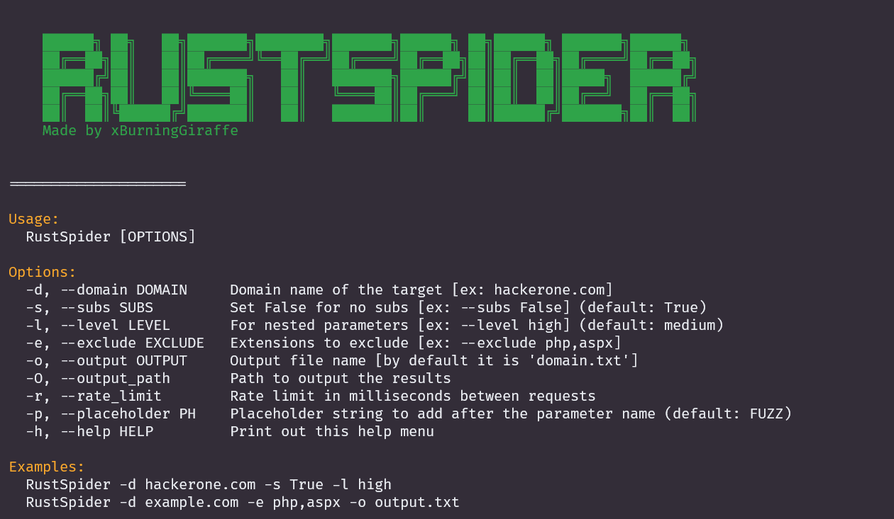

# RustSpider

## Overview
RustSpider is a parameter discovery suite built in Rust for web penetration testing. It helps you find URLs with parameters, aiding in the discovery of potential points of injection or manipulation.
This project is based on ParamSpider by @devanshbatham



## Features
- Domain targeting with subdomain inclusion.
- Customizable rate limiting.
- Nested parameter discovery.
- Output to a specified file or directory.
- User-agent randomization.

## Requirements
- Rust
- Cargo

## Installation
Clone the repository and build the project using Cargo.
```
git clone https://github.com/xBurningGiraffe/RustSpider.git
cd RustSpider
cargo build --release
```

## Usage
```
RustSpider [OPTIONS]
```
### Options
- `-d`, `--domain DOMAIN`     : Domain name of the target (e.g., hackerone.com)
- `-s`, `--subs SUBS`         : Include subdomains (True/False, default: True)
- `-l`, `--level LEVEL`       : Nested parameter level (e.g., high, medium, low)
- `-e`, `--exclude EXCLUDE`   : File extensions to exclude (e.g., php, aspx)
- `-o`, `--output OUTPUT`     : Output file or directory
- `-r`, `--rate RATE`         : Rate limiting in milliseconds
- `-p`, `--placeholder PH`    : Placeholder string to add after the parameter name (default: FUZZ)
- `-h`, `--help`              : Displays the help menu

### Examples
```
RustSpider -d hackerone.com -s True -l high
RustSpider -d example.com -e php,aspx -o output.txt
```

## Contributing
Feel free to open issues or submit pull requests.

## License
MIT

